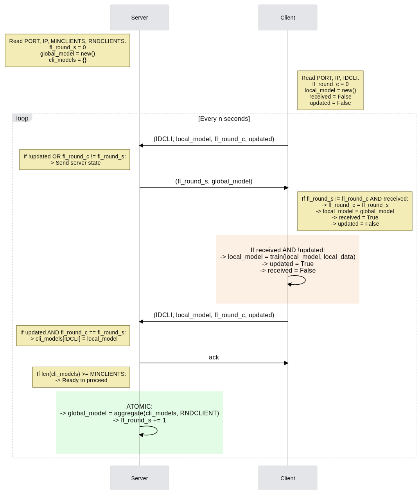
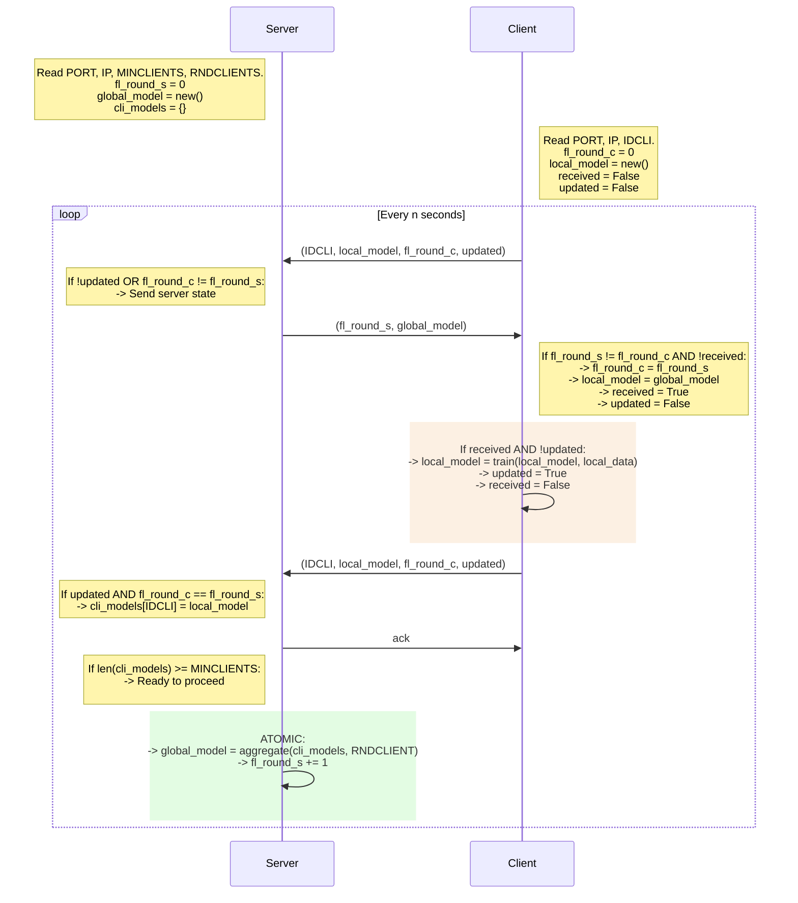

# ryofl
(don't) roll your own federated learning


## Desiderata

There are a number of characteristics, that we would like to have in a Federated
Learning framework, that are not really covered in existing frameworks.

Some of the objectives are:

 - *Keep it simple* It should be **really** easy to use this code. It should
   also be equally simple to develop variations starting from this code base.

 - *Actual clients* Simulate each client individually.

 - *Run everywhere* Deploy on multiple small machines.

There are also aspects of the simulation that we would like to make more
realistic, such as:

 - *Rolling window on data* Local data shouldn't (always) be considered stable.
   In a realistic setting local data would become stale over time, and new data
   points would be added periodically.


## Dependencies

Make sure the package `liblzma-dev` is installed in your system.
(`sudo apt install liblzma-dev`)

Pytorch CPU needs to be installed following the instructions provided
on the official website:

```
pip install torch==1.8.1+cpu torchvision==0.9.1+cpu torchaudio==0.8.1 -f https://download.pytorch.org/whl/torch_stable.html

```

Before continuing please make sure you have setup the correct paths in
`ryofl/common.py`.

Install requirements with `make init`, and install the package with `make
install`. 


## Testing

Run tests with `make test`.

Testing is done via `pytest`.  Tests will be automatically discovered by looking
in the `tests/` directory for files and functions having `test` as a prefix.


## Training protocol

Centralized protocol for federated learning implemented in ryofl:


<details>
<summary>mermaid code for the diagram</summary>



</details>


## Running the system


### Obtaining the datasets

Use `python ryofl/generate_datasets.py` to download the datasets. The location
of the downloaded files is specified in `ryofl/common.py`.

This script will also split the datasets into per-client chunks, based on the
specific logic of each dataset, and populate sub-directories with the chunk
numpy files.

**Note:** this is the only part of the code which depends on
Tensorflow-Federated.


### Distributed execution

Generate the configuration files for the server and each client with:

```
python -m ryofl.server make-configs --dataset femnist --model_id cnn --clients 4 --workers 1 --aggregation averaging
```

Here, the `-- aggregation averaging` parameter will indicate which aggregation
function to use. Users can specify their own aggregation functions by defining
them in `ryofl/fl/aggregations.py` and providing the correct identifier here.

The `--workers` option indicates how many worker threads will be generated by
each of the clients participating in the protocol. A conservative approach to
selecting this value is suggested.

These files will, by default, be create in the `configs/` folder. This can be
changed in `ryofl/common.py`.
Configuration files are human-readable json formatted, and will also contain the
list of data files each client should use during the training.

#### Server

The server script can then be run with:
```
python -m ryofl.server fl --config configs/cfg_file_0.json  
```

By default the server will wait for a sufficient number of clients to join
before the actual training protocol begins.


#### Clients

Similarly, running the clients script will look like:
```
python -m ryofl.client fl --config configs/cfg_file_1.json  
```

**Note:** please be careful to assign the correct configuration file to each
client.
